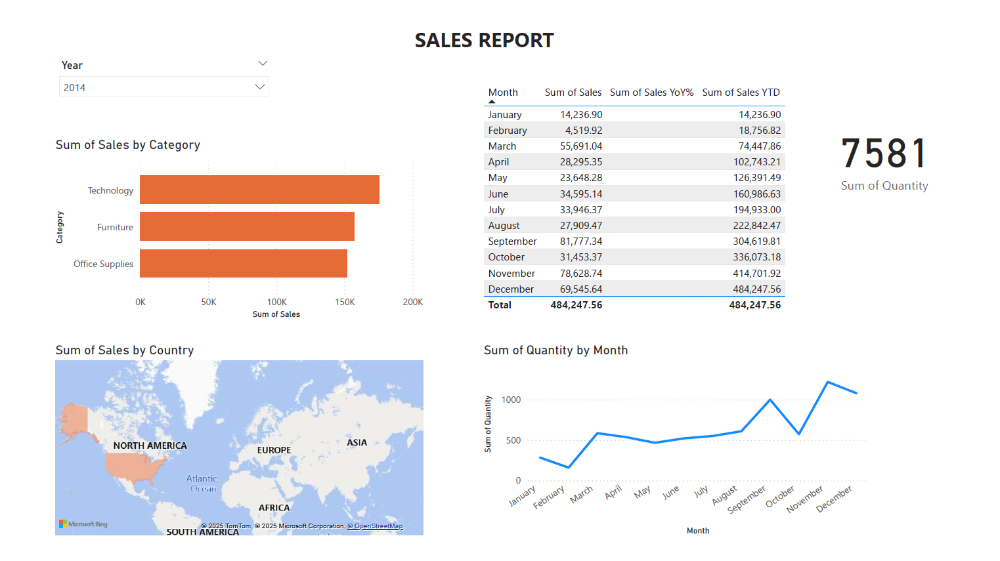

# 📊 Sales Analysis Project

## 📌 Overview
This project analyzes the **Superstore Sales dataset** to explore sales, profit, customer behavior, and trends.  
The dataset was downloaded from Kaggle:  
🔗 [Superstore Dataset (Kaggle)](https://www.kaggle.com/datasets/vivek468/superstore-dataset-final?resource=download)

---

## 🛠 Tools & Technologies
- **Excel** → Data cleaning & Pivot Tables  
- **PostgreSQL (pgAdmin)** → SQL queries & results  
- **Power BI** → Dashboard creation & visualization  
- **GitHub** → Project documentation and sharing  

---

## 📂 Project Structure
```

/all_queries.sql                 # All SQL queries used in PostgreSQL
/queries_results                 # Exported result tables from queries
/superstore.xlsx                 # Cleaned dataset + Pivot Tables
/superstore_dashboard.pbix       # Power BI Dashboard file
/docs/report.pdf                 # One-page project summary (with screenshots)

```

---

## 📊 Dashboard Preview



---

## 🧾 Queries & Results
- All queries are available in: **`/all_queries.sql`**  
- Query outputs (CSV/Excel) are stored in: **`/queries_results/`**

---

## 📄 Report
A one-page PDF summary with project workflow, KPIs, and dashboard screenshot is available here:  
👉 [docs/report.pdf](docs/report.pdf)


