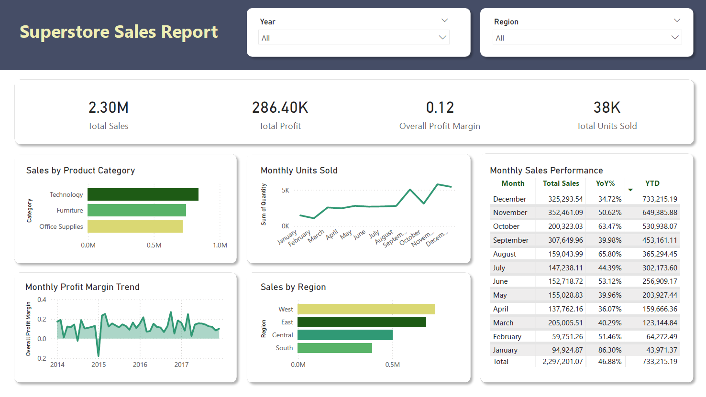

# 📊 Superstore Sales Analysis — SQL · Excel · Power BI

---

## 1. Project Overview

This project analyzes the **Superstore Dataset** ([Kaggle link](https://www.kaggle.com/datasets/vivek468/superstore-dataset-final)), which contains order-level information such as sales, profit, category, region, and customer details.  

The objective was to build an **end-to-end data analysis pipeline** and an **interactive dashboard** to answer key business questions:

- What are the overall sales and profitability trends over time?  
- Which product categories and regions contribute the most?  
- How do sales volumes (units sold) evolve across months and years?  
- Where are the growth opportunities and how can profitability be improved?  

**Workflow:**
- **SQL** → inspection, cleaning, and business queries (`/sql/all_queries.sql`, outputs in `/sql/queries_results/`)  
- **Excel** → pivot tables & initial visualizations (`/excel/superstore_analysis.xlsx`)  
- **Power BI** → interactive dashboard (`/powerbi/superstore_dashboard.pbix`)  

---

## 2. Data Structure

The dataset includes:  

- **Dates:** Order Date, Ship Date  
- **Numerical:** Sales, Quantity, Profit, Discount  
- **Categorical:** Category, Sub-Category, Region, Country, Customer  

A **Date Table** was created in Power BI to support accurate time-series and YoY analysis.  

---

## 3. Executive Summary

- **Total Sales (2014–2017):** ~\$2.30M  
- **Total Profit:** ~\$286K  
- **Overall Profit Margin:** ~12%  
- **Total Units Sold:** ~38K  

- **Top Category:** Technology (~36% of total sales)  
- **Top Region:** West (~32% of total sales)  

- **Annual Sales Growth:** Sales peaked in **2017 with \$733K** (📈 +55% vs. 2015).  
- **Seasonality:** Strong Q4 peaks every year, with December consistently the highest month.  

---

## 4. Dashboard Preview

**Key Features:**
- KPI cards for *Total Sales, Profit, Profit Margin, Units Sold*  
- **Monthly Sales Performance** (Total, YoY%, YTD)  
- **Sales by Category & Region** breakdowns  
- **Monthly Units Sold trend**  
- **Profit Margin trend** across 2014–2017  

---

## 5. Insights

### 📦 Product Categories
- **Technology** dominates with 36% of sales (main revenue driver).  
- **Furniture** and **Office Supplies** contribute almost equally (~32% each) but lag slightly behind Technology.  
- → Opportunity to diversify the product mix and strengthen these categories.  

### 🌍 Regional Performance
- **West (32%)** and **East (30%)** are strongest.  
- **South (17%)** is underperforming.  
- → Targeted campaigns in South could improve contribution.  

### 📈 Trends & Growth
- Sales grew steadily from 2014 → 2017, peaking at \$733K.  
- Clear seasonal spikes in **Q4 (holiday season effect)**.  
- Units sold also follow this seasonal trend.  

### 💰 Profitability
- Average **Profit Margin ~12%**.  
- Margin volatility indicates discount strategies impact profitability.  
- → Optimizing discounts (especially in Furniture) could protect margins.  

---

## 6. Recommendations

1. **Expand Technology Product Lines** → Accessories/bundles to leverage the top-performing category.  
2. **Boost South Region Sales** → Targeted promotions, localized marketing, and distribution improvements.  
3. **Leverage Q4 Peaks** → Launch loyalty programs and early holiday campaigns before Q4.  
4. **Diversify Product Mix** → Reduce reliance on Technology, strengthen Furniture and Office Supplies.  
5. **Optimize Discounts** → Monitor discount impact on margins to avoid profit erosion.  
6. **Retention Programs** → Incentivize repeat buyers to stabilize long-term revenue.  

